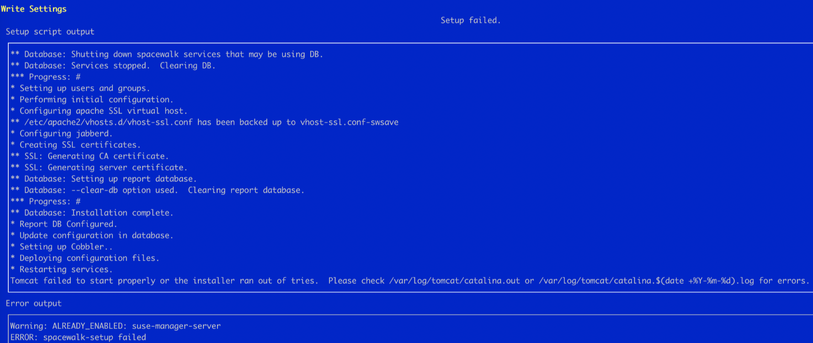
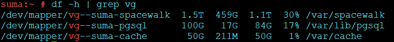
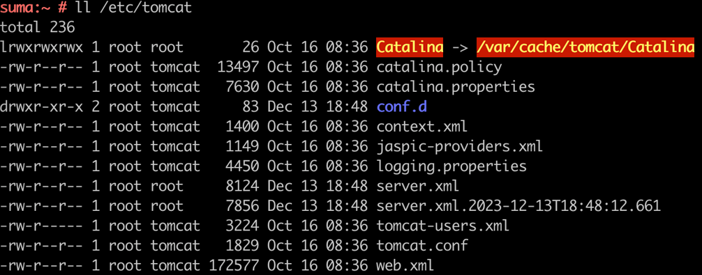
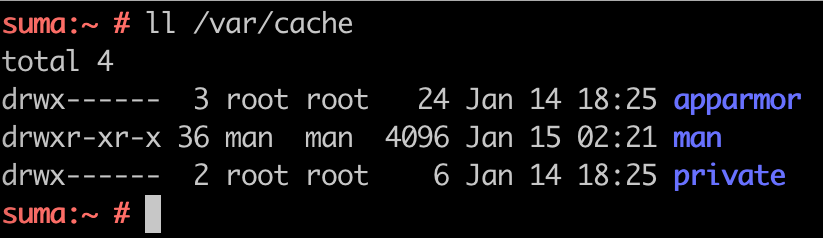
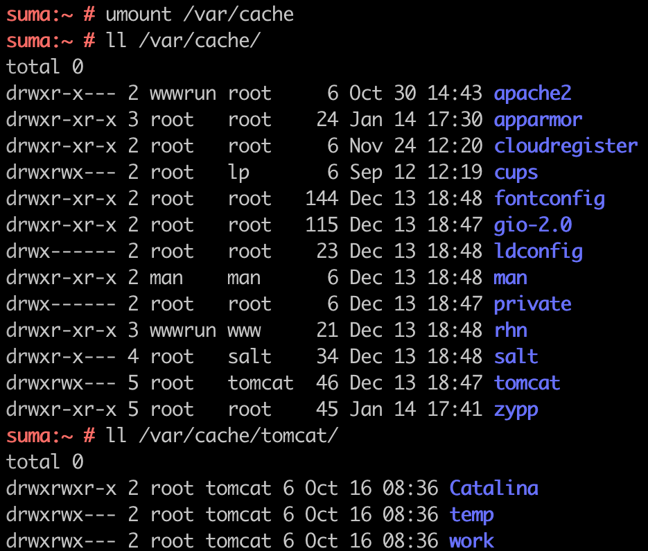

= Setting up SUSE Manager with separate disk for data in Public Cloud (BYOS)

**Issue:** 

{productname} setup results with an error while restarting services during setup. 

The set up gets failed on restarting Tomcat.

**Reason:**

When {productname} is set up using separate disks for cache, pgsql and spacewalk, the already present data within these partitions are covered under the new mount point.

 

Because of which data for certain services like tomcat goes missing due to broken symlink.

 

As SUSE Manager instance of cloud already have some services setup these data when not available during setup causes the service to not restart as expected and the setup to fail in turn.

  

Actual data which should be present:

  

**How to Recreate:**

1. {productname} Server provisioned in {aws} uses relevant AMI for {byos}

2. Separate Storage for Spacewalk, PostgreSQL and Cache. (Size of the partition depends on the repository to be synced.)

3. Setup SUSE Manager using `yast2 susemanager_setup`

   

**Resolution:**

To resolve or avoid the issue, copy the data of the underlying partition into the new partition by following the steps below:

. Create a backup partition
+
----
mkdir /bkp
----

. Unmount the affected partition for example /var/cache. 
+
----
umount /var/cache
----

. Check the underlying data in the partition. 
  This should list the actual data present in the directory.
+
----
ll /var/cache
----

. Copy the data onto the backup partition created in step 1.
+
----
cp -prav /var/cache/* /bkp/
----

. Mount the partition again using option 1 or 2:
+
----
(option 1)   /dev/nvme0nxx /var/cache
(option 2)   mount -a (if you have the entries under /etc/fstab)
----

. Copy the backed up data from step 4 to the mounted partition
+
----
cp -prav /bkp/* /var/cache/
----

. Verify the data is present
+
----
ll /var/cache/
----

. Repeat the {productname} setup
+
----
yast2 susemanager_setup
----

   

**Conclusion**:

When using {procustname} in public cloud with separate data partitions, make sure that the already present data in those directories are copied onto the new partition.

